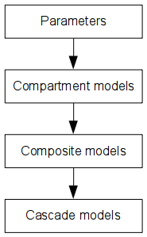

.. _adding_models:

#############
Adding models
#############
In MDT, models are constructed in an object oriented fashion with more complex objects being constructed out of simpler parts.
The following figure shows the order of model construction in MDT:

That is, compartments models are constructed using one or more parameters, composite models are built out of one or more compartment models and cascade models consist out of one or more composite models.

In MDT, models are added just by defining them using a templating mechanism, i.e. a dynamic library system in which components can be overridden by newer versions just by defining the component.
For example, adding a new compartment model or overriding an existing one can be done just by stating:

.. code-block:: python

    from mdt import CompositeModelTemplate

    class BallStick_r1(CompositeModelTemplate):
        model_expression = '''
            S0 * ( (Weight(w_ball) * Ball) +
                   (Weight(w_stick0) * Stick(Stick0)) )
        '''

In this example we overwrite the existing ``BallStick_r1`` model with a completely new model.
Here, ``CompositeModelTemplate`` tells MDT that this class should be interpreted as a template for a dMRI composite model.
By virtue of meta-classes, this template will automatically be added to the MDT component library for future use.

Using Object Oriented inheritance it is possible to partially rewrite existing models with updated definitions.
For example, instead of defining a completely new ``BallStick_r1`` model, we can also inherit from the existing template:

.. code-block:: python

    from mdt import get_template

    class BallStick_r1(get_template('composite_models', 'BallStick_r1')):
        likelihood_function = 'Rician'

Here, we inherit from the existing template and overwrite the likelihood function with Rician.
All other definitions will be taken from the previous template.
Afterwards you can directly use it in your model fitting code:

.. code-block:: python

    from mdt import get_template

    class BallStick_r1(get_template('composite_models', 'BallStick_r1')):
        likelihood_function = 'Rician'

    mdt.fit_model('BallStick_r1', ...)

which will now use the Ball&Stick model with a Rician noise model.

************************
Global model definitions
************************
For persistent model definitions you can use the ``.mdt`` folder in your home folder.
This folder contains diffusion MRI models and other functionality that you can extend without needing to reinstall or recompile MDT.

The ``.mdt`` folder contains, for every version of MDT that existed on your machine, a directory containing the configuration files and a
folder with the dynamically loadable modules.
A typical layout of the ``.mdt`` directory is:

* .mdt/
    * <version>/
        * mdt.default.conf
        * mdt.conf
        * components/

The configuration files are discussed in :ref:`configuration`, the components folder is used for the global model definitions.

The components folder consists of two sub-folders, *standard* and *user*, with an identical folder structure for the contained modules:

* components/
    * standard
        * compartment_models
        * composite_models
        * ...
    * user
        * compartment_models
        * composite_models
        * ...

By editing the contents of these folders, the user can add, extend and/or remove functionality globally and persistently.
The folder named *standard* contains modules that come pre-supplied with MDT.
These modules can change from version to version and any change you make in in this folder will be lost after an update.
To make persistent changes you can add your modules to the *user* folder.
The content of this folder is automatically copied to a new version.

*********************************
Dynamically redefining components
*********************************
Alternatively, as stated in the introduction, it is also possible to overwrite existing models on the fly, for example:

.. code-block:: python

    import mdt

    class Tensor(mdt.get_template('composite_models', 'Tensor')):
        likelihood_function = 'Rician'

    mdt.fit_model('Tensor (Cascade)', ...)

Breaking this up, in the first part::

    class Tensor(mdt.get_template('composite_models', 'Tensor')):
            likelihood_function = 'Rician'

we load the last available Tensor model template from MDT (using ``get_template('composite_models', 'Tensor')``) and use it as a basis for an updated template.
Then, since this class is also named Tensor (by saying ``class Tensor(...)``) this new template will override the previous Tensor.
The body of this template then updates the previous Tensor, in this case by changing the likelihood function.

In the second part::

    mdt.fit_model('Tensor (Cascade)', ...)

we just call ``mdt.fit_model`` with as model ``Tensor (Cascade)``.
MDT will then load the cascade and its models by taking the last known definitions.
As such, the new ``Tensor`` model with the updated likelihood function will be used in the model fitting.

To remove an entry, you can use, for example::

    mdt.remove_last_entry('composite_models', 'Tensor')

This functionality allows you to overwrite and add models without adding them to your home folder.

.. include:: _dynamic_modules/composite_models.rst
.. include:: _dynamic_modules/compartment_models.rst
.. include:: _dynamic_modules/parameters.rst
.. include:: _dynamic_modules/cascade_models.rst
.. include:: _dynamic_modules/library_functions.rst
.. include:: _dynamic_modules/batch_profiles.rst
