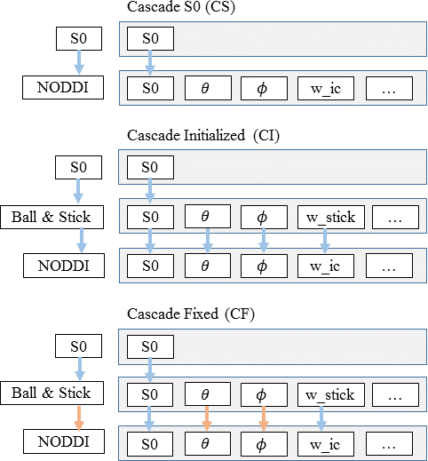
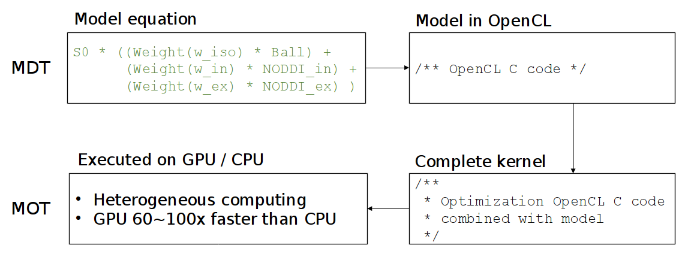

########
Concepts
########

This chapter introduces the reader to a few concepts that help to get started using this software.

.. contents:: Table of Contents
   :local:
   :backlinks: none

.. _concepts_protocol:

********
Protocol
********
In MDT, the Protocol contains the MRI measurement settings and is, by convention, stored in a protocol file with suffix ``.prtcl``.
In such a protocol file, every row represents an MRI volume, and every column (tab separated) represents a specific protocol setting.
Since every row (within a column) can have a distinct value, this setup automatically enables *multi-shell protocol* files (just change the b-value per volume/row).

The following is an example of a simple MDT protocol file::

    #gx,gy,gz,b
    0.000e+00    0.000e+00    0.000e+00    0.000e+00
    5.572e-01    6.731e-01    -4.860e-01   1.000e+09
    4.110e-01    -5.254e-01   -7.449e-01   1.000e+09
    ...

And, for a more advanced protocol file::

    #gx,gy,gz,Delta,delta,TE,b
    -0.00e+0   0.00e+0   0.00e+0  2.18e-2   1.29e-2   5.70e-2   0.00e+0
     2.92e-1   1.71e-1  -9.41e-1  2.18e-2   1.29e-2   5.70e-2   3.00e+9
    -9.87e-1  -8.54e-3  -1.60e-1  2.18e-2   1.29e-2   5.70e-2   5.00e+9
    ...

The header (starting with #) is a single required line with per column the name of that column.
The order of the columns does not matter but the order of the header names should match the order of the value columns.
MDT automatically links protocol columns to the protocol parameters of a model (see :ref:`protocol_parameters`), so make sure that the columns names are identical to the
protocol parameter names in your model.

The pre-provided list of column names is:

* **b**, the b-values in :math:`s/m^2` (:math:`b = \gamma^2 G^2 \delta^2 (\Delta-\delta/3)` with :math:`\gamma = 2.675987E8 \: rads \cdot s^{-1} \cdot T^{-1}`)
* **gx, gy, gz**, the gradient direction as a unit vector
* **Delta**, the value for :math:`{\Delta}` in seconds
* **delta**, the value for :math:`{\delta}` in seconds
* **G**, the gradient amplitude
* **TE**, the echo time in seconds
* **TR**, the repetition time in seconds

Note that MDT expects the columns to be in **SI units**.

The protocol dependencies change per model and MDT will issue a warning if a required column is missing from the protocol.
If no b-value is provided, MDT will calculate one using Delta, delta and G.
If the b-value and two out of three of ``{Delta, delta, G}`` are given, the provided b-value will take preference.
If at least three of ``{b, Delta, delta, G}`` are given the missing value will be calculated automatically when required.

A protocol can be created from a bvec/bval pair using the command line, python shell and/or GUI.
Please see the relevant sections in :ref:`analysis` for more details on creating a Protocol file.

.. _concepts_problem_data_models:

************
Problem data
************
In MDT, all data that is needed to fit a model is stored in a :py:class:`~mdt.utils.DMRIProblemData` object.
An instance of this object needs to be created before fitting a model.
Then, during model fitting, the model loads the relevant data for the computations.

The easiest way to instantiate a problem data object is by using the function :func:`~mdt.utils.load_problem_data`.
At a bare minimum, this function requires:

* ``volume_info``, a path to the diffusion weighted volume
* ``protocol``, an Protocol instance containing the protocol information
* ``mask``, the mask (3d) specifying which voxels to use for the computations

Additionally you can provide a *dictionary of static maps*, a *gradient deviations* file and a *standard deviation* for the noise.
For the *noise standard deviation* you have the choice to either provide a single value, an ndarray with a value per voxel, or the string 'auto'.
If 'auto' is given, MDT will use one or more of the :ref:`dynamic_modules_noise_std_estimators` to estimate the standard deviation of the
noise of the unweighted diffusion MRI in the complex plain.
The *gradient deviations* is a map specifying how the g vector differs in different areas in the scan.
This should be stored in the format described by the HCP Wu-Minn project.
With the *static maps* the user can optionally provide a dictionary of maps to use in the model fitting.
The model will take from this what it needs (and if it needs it) for model optimization.
These maps can either contain one value per voxel or one value per voxel per volume.
This is useful for for example static T1 maps for use in complex models.

***************
Dynamic modules
***************
Extending and adapting MDT with new models is made easy using dynamically loadable modules placed in your home folder.
These modules are Python files placed in the ``.mdt`` folder in your home drive and are reloaded every time MDT is started.
Users are free to add, remove and modify components in this folder and MDT will pickup the changes automatically.
See :ref:`dynamic_modules` for more information.

.. _concepts_composite_and_cascade_models:

****************************
Composite and cascade models
****************************
Broadly there are two types of models that MDT can use in the model fitting routines,
single composite models like "BallStick_r1" and cascade models like "BallStick_r1 (Cascade)".
The composite models are simply multi-compartment models like "NODDI" and "CHARMED" taken from the reference papers and are the models being optimized by the optimization algorithms.
Cascade models add a layer on top of the composite models by optimizing multiple models in turn and using the calculated maps of the more simpler models
for the initialization of the more complex models.
These cascade models are not directly optimized per-se but are more of an initialization strategy for the final model in the cascade.

By default, the composite models follow a naming scheme in which models that can feature more than one restricted compartment are indicated with the postfix ``_r{n}``, where n is the number of restricted compartments.
For example "BallStick_r1" is a model with only one restricted compartment (i.e. only one Stick), while the model "BallStick_r2" has two restricted compartments.
The restricted compartment can differ per model, for example, in the "CHARMED_r2" model we have two cylinders since the restricted compartment in the "CHARMED" model is a cylinder.

In terms of cascaded models, MDT comes standard pre-supplied with three variants:

* Cascade S0 (CS) with the postfix "(Cascade|S0)"
* Cascade Initialized (CI) with the postfix "(Cascade)"
* Cascade Fixed (CF) with the postfix "(Cascade|fixed)"

All these cascade variants are ways of initializing the next model in the cascade to ensure a good starting position.
In Harms 2017 :cite:`Harms201782` it is shown that this way of cascading can improve the fit over regular model optimization.

The following figure shows how the three different cascades work with as example the NODDI model.

    Illustration of the three different cascading strategies (for the example of the NODDI model): CS, CI and CF.
    The blue arrows indicate initialization of a parameter, the orange arrows indicate fixing a parameter.

In general we always recommend to run at least a "(Cascade|S0)" for any model and to gradually move to CI with the "(Cascade)" postfix
or CF with the "(Cascade|fixed)" postfix.

.. _concepts_cl_code:

*******
CL code
*******
While MDT (and MOT) are programmed in Python, the actual computations are executed using OpenCL.
OpenCL is a platform and language specification that allows you to run C-like code on both the processor (CPU) and the graphics cards (GPU).
The reason MDT can be fast is since it a) uses a compiled language (OpenCL C) for the computations and b) executes this on the graphics card and/or all CPU cores.

The compartment models in MDT are programmed in the OpenCL C language (CL language from hereon).
See (https://www.khronos.org/registry/cl/sdk/1.2/docs/man/xhtml/mathFunctions.html) for a quick reference on the available math functions in OpenCL.

When optimizing a multi-compartment model, MDT combines the CL code of all your compartments into one large function and uses MOT to optimize this function using the OpenCL framework.
See this figure for the general compilation flow in MDT:

When creating a compartment model in MDT, please make sure to follow the compartment modeling guidelines in :ref:`model_building_defining_compartments` to prevent naming conflicts.
Since OpenCL kernels have a single global function namespace and a lot of functions are combined into one kernel
(e.g. compartment models, optimization routines, library routines etc.) it is possible to have naming conflicts.
If you follow the modeling guidelines you are generally fine.

To support both single and double floating point precision, MDT uses the ``mot_float_type`` instead of ``float`` and ``double`` for most of the variables and function definitions.
During optimization and sampling, ``mot_float_type`` is type-defined to be either a float or a double, depending on the desired precision.
Of course this does not limit you to use ``double`` and ``float`` as well in your code.

.. rubric:: References

.. bibliography:: references.bib
    :cited:
    :style: plain
