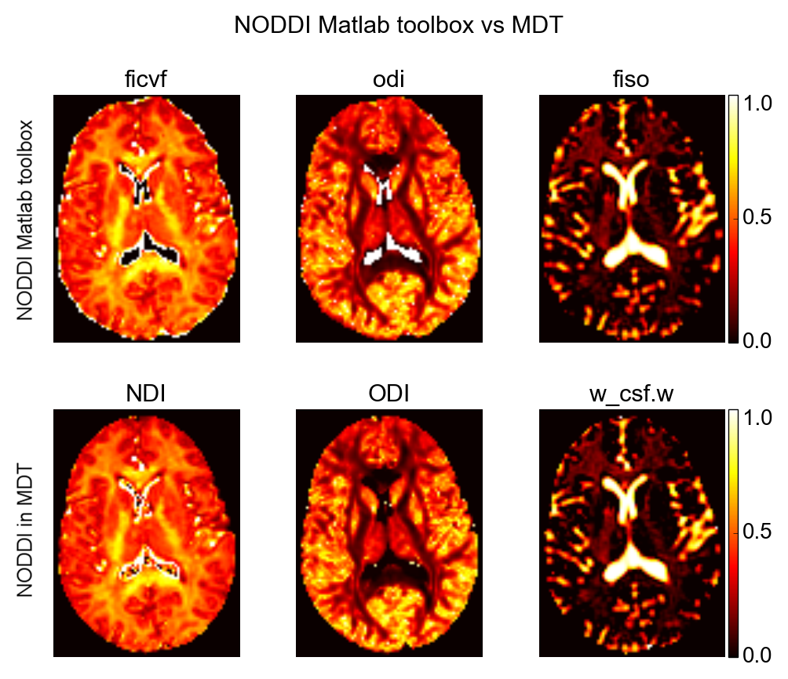

##########################
Frequently Asked Questions
##########################

.. contents:: Table of Contents
   :local:
   :backlinks: none

*********************
Installation problems
*********************

.. _faq_clGetPlatformIDs_failed:

MDT crashes with "clGetPlatformIDs failed: <unknown error -1001>"
=================================================================
After a successful installation some users are confronted with the message ``pyopencl.cffi_cl.LogicError: clGetPlatformIDs failed: <unknown error -1001>`` when starting MDT.
This is an OpenCL environment related problem and can have two causes, either the OpenCL environment is not correctly installed or PyOpenCL can not find the environment.

Check OpenCL environment
------------------------
The first thing to do would be to install an independent package to test the presence of the OpenCL environment on your computer.
In Linux that package could be the ``clinfo`` package, found in the repository of all major distributions (Debian, Ubuntu, Suse).
If that command also fails to run then your OpenCL environment is not installed correctly.
Please double check the full installation guide and try to install the OpenCL driver for the device you are targeting.

Working OpenCL
--------------
If OpenCL is correctly installed but PyOpenCL still crashes, then the problem could be related to PyOpenCL using the wrong libraries.
This could be solved by reinstalling PyOpenCL (``pip uninstall pyopencl``, ``pip install pyopencl``).

.. _faq_no_opencl_device_found:

No OpenCL device found
======================
If there are no CL devices visible in the GUI and the shell command ``mdt-list-devices`` returns nothing, no computations can be done using MDT.
To continue using MDT, OpenCL enabled hardware and corresponding drivers must be installed in your system.

Check devices
-------------
First, make sure that the graphics card and/or CPU in your system is capable of OpenCL acceleration.
To do so, look up the device name in your computer and find its specifications on the internet.
The device must support OpenCL and at least OpenCL version 1.2.

Check drivers
-------------
If your preferred device supports OpenCL and it does not show in MDT, you may be missing the device drivers.

If you would like to run the computations on a GPU (graphics card), please install the correct drivers for that card.
If you would like to run the computations on the CPU, you have two possibilities.
The first is to install an AMD graphics card, their drivers come pre-supplied with OpenCL drivers for CPU's (for both Intel and AMD).
If you do not have a graphics card, or you have an NVidia card, you will have to install the `Intel OpenCL Drivers <https://software.intel.com/en-us/articles/opencl-drivers>`_ to your system.

The GUI fails to start
======================
You have successfully installed MDT, but starting the Graphical User Interface (GUI) fails.
Most of the time this is because PyQt5 is not installed on your machine.
If you are using Windows, please make sure you are using the latest Anaconda version (> 4.2.0), at least one that includes PyQt5.
If you are using Linux, please make sure you download the correct Python PyQt5 package for your machine.
That should have been done automatically when you used the Ubuntu PPA.

********
Analysis
********

How does NODDI in MDT compare to the NODDI toolbox?
===================================================
Please see the following figure for a graphical comparison between the NODDI Matlab toolbox and MDT on a single slice of the NODDI example dataset (the dataset accompanying the Matlab implementation).

    Comparison between the NODDI Matlab implementation (top) and MDT (bottom).

For all practical purposes both toolboxes are in high agreement in white matter.
There are some small differences visible in the CSF.
These differences are caused by NODDI model unidentifiability, that is, the intracellular compartment with a high dispersion can substitute
for the Ball compartment in CSF (this is similar to the findings in Jelescu 2015 :cite:`Jelescu2015`).

The NODDI Matlab results where computed using the NODDI Matlab toolbox by Dr. Gary Zhang, version 0.9 with Matlab 2012b on an Ubuntu 14.04 system.
The MDT results where computed using MDT version 0.9.31 and MOT version 0.2.39 on the same Ubuntu system, using an AMD Fury X graphics card for the computations.
We used here the cascade fixed initialization strategy ("NODDI (Cascade|fixed)") and the default Powell optimizer with a patience of 2.

What do the "model protocol options" entries in the log file mean?
==================================================================
This message represent itself either as "Applying model protocol options, we will use a subset of the protocol and DWI." or as "No model protocol options to apply, using original protocol."
In both cases, this refers to the :ref:`dynamic_modules_composite_models_protocol_options` set in the composite model you fitted or sampled.
In the first case we are applying model protocol options and hence we are only using a subset of all volumes, in the second case we use all volumes.
See the part about the :ref:`dynamic_modules_composite_models_protocol_options` for more information and on how to define these protocol options.

Why does the noise standard deviation differ when using another mask?
=====================================================================
By default MDT tries to estimate the noise standard deviation of the images in the complex domain.
This standard deviation is used in the analysis as the standard deviation in the evaluation model (commonly Offset-Gaussian).
This standard deviation is commonly estimated using an average of per-voxel estimations.
When a different mask is used there are different voxels used for the standard deviation estimation and hence the resulting value differs.

To prevent this from happening it is suggested that researchers estimate the noise std. beforehand using a whole brain mask and use that value in all other analysis.

.. rubric:: References

.. bibliography:: references.bib
    :cited:
    :style: plain
    :filter: author % "Jelescu"
