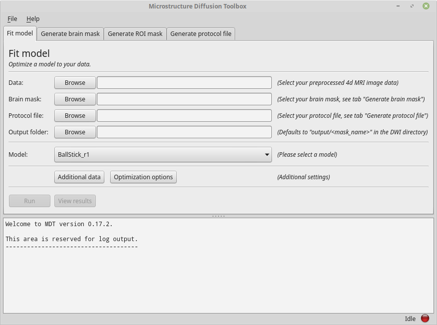
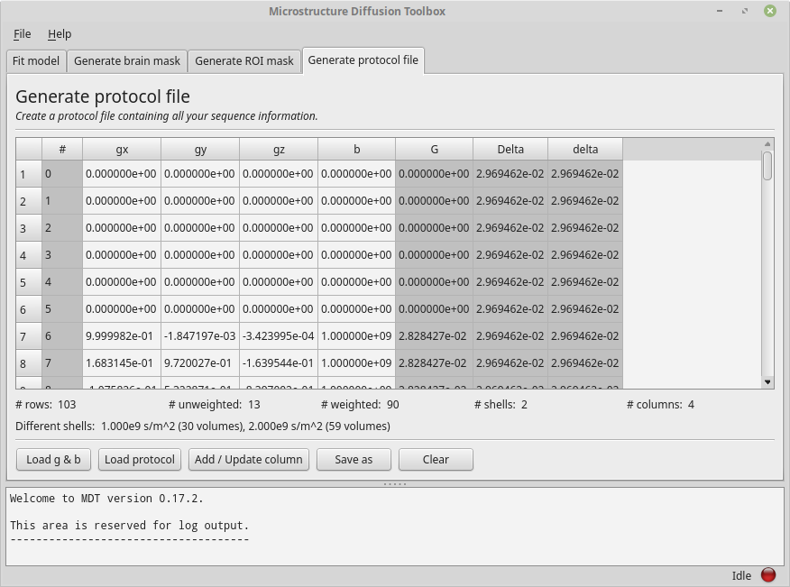
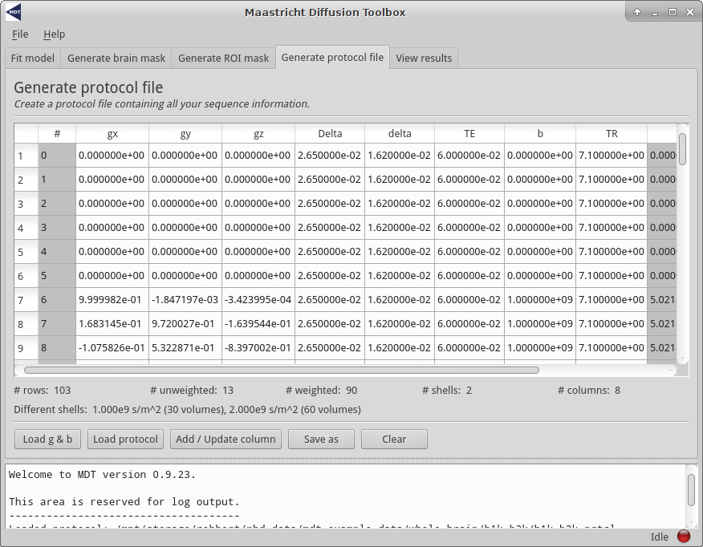
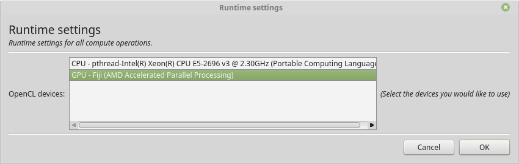
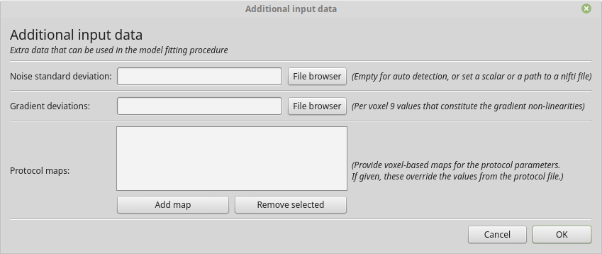
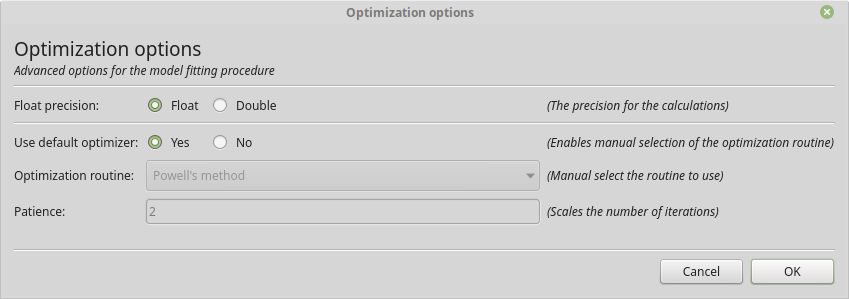
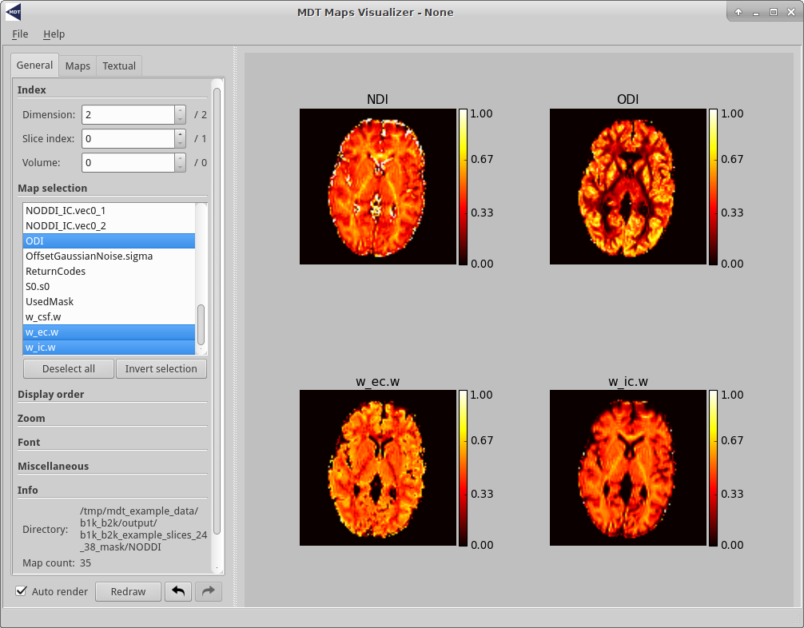
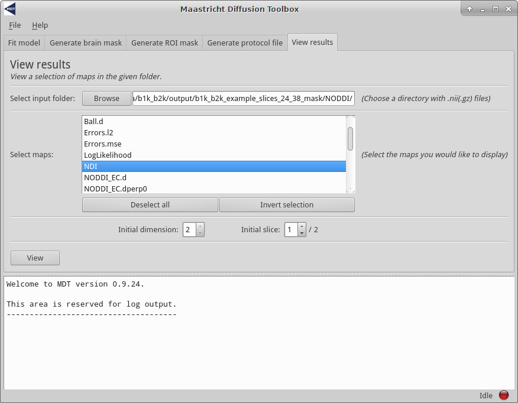

###############
Getting started
###############

************
HCP Pipeline
************
MDT comes pre-installed with Human Connectome Project (HCP) compatible pipelines for the MGH and the WuMinn 3T studies.
To run, please change directory to where you downloaded your (pre-processed) HCP data (MGH or WuMinn) and execute:

.. code-block:: console

    $ mdt-batch-fit . 'NODDI (Cascade)'

and it will autodetect the study in use and fit your selected model to all the subjects.

Some of the models you can use are: ``NODDI``, ``ActiveAx``, ``CHARMED_r1``, ``Tensor``, ``BallStick_r1`` and cascaded versions of these.
For a complete list of models run the command :ref:`cli_index_mdt-list-models` and for more information about cascades see :ref:`concepts_composite_and_cascade_models`.

.. _mdt_example_data:

****************
MDT example data
****************
MDT comes pre-loaded with some example data that allows you to quickly get started using the software.
This example data can be obtained in the following ways:

* **GUI**: Open the model fitting GUI and find in the menu bar: "Help -> Get example data".
* **Command line**: Use the command :ref:`cli_index_mdt-get-example-data`:

.. code-block:: console

    $ mdt-get-example-data .

* **Python API**: Use the function :func:`mdt.utils.get_example_data`:

.. code-block:: python

    import mdt
    mdt.get_example_data('/tmp')

There are two MDT example datasets, a *b1k_b2k* dataset and a *multishell_b6k_max* dataset, both acquired in the same session on a Siemens Prisma system, on the VE11C software line,
with the standard product diffusion sequence at 2mm isotropic with GRAPPA in-plane acceleration factor 2 and 6/8 partial fourier (no multiband/simultaneous multi-slice).

The *b1k_b2k* has a shell of b=1000s/mm^2 and of b=2000s/mm^2 and is very well suited for e.g. Tensor, Ball&Stick and NODDI.
In this, the b=1000s/mm^2 shell is the standard Jones 30 direction table, including 6 b0 measurements at the start.
The b=2000s/mm^2 shell is a 60 whole-sphere direction set create with an electrostatic repulsion algorithm and has another 7 b0 measurements, 2 at the start of the shell and then one every 12 directions.

The *multishell_b6k_max* dataset has 6 b0's at the start and a range of 8 shells between b=750s/mm^2 and b=6000s/mm^2 (in steps of 750s/mm^2) with an increasing number of directions per shell
(see `De Santis et al., MRM, 2013 <http://dx.doi.org/10.1002/mrm.24717>`_) and is well suited for CHARMED analysis and other models that require high b-values (but no diffusion time variations).

.. _analysis:

***********************
Single subject analysis
***********************
There are three ways to interface with MDT, the :ref:`Graphical User Interface (GUI) <analysis_using_the_gui>`,
:ref:`the command line <analysis_using_the_cli>` and :ref:`using Python directly <analysis_using_python>`.
This guide will walk you through basic model analysis with MDT using all of these interfaces.

This guide can in principle be followed with any compatible dataset, but it is suggested to first follow the guide using the MDT example datasets, see :ref:`mdt_example_data` for obtaining these.

.. _analysis_using_the_gui:

Using the GUI
=============
One of the ways to use MDT for model analysis is by using the Graphical User Interface (GUI).
After installation a few utility scripts are available on your system, one of which launches the GUI.
To launch the GUI in Linux and OSX, please open a console and type ``mdt-gui`` or ``MDT`` to launch the analysis GUI.
In Windows one can either open an Anaconda prompt and type ``mdt-gui`` or ``MDT`` or, alternatively,
one can type ``mdt-gui`` or ``MDT`` in the search bar under the start button to find and launch the GUI.

The following is an example of the GUI running in Linux:

    A screenshot of the MDT GUI in Linux.

Using the GUI is a good starting point for model analysis since it guides you through the steps needed for the model analysis.
In addition, as a service to the user, the GUI writes Python and Bash script files for most of the actions performed in the GUI.
This allows you to use the GUI to generate a coding template that can be used for further processing.

Creating a protocol file
------------------------
As explained in :ref:`concepts_protocol`, MDT stores all the acquisition settings relevant for the analysis in a Protocol file.
To create one using the GUI, please go to the tab "Generate protocol file".
On the bottom of the tab you can find the button "Load g & b" which is meant to load a b-vec and b-val file into the GUI.
Please click the button and, for the sake of this example, load from the MDT example data folder the b-vec and b-val file of the b1k_b2k dataset.
This tab should now look similar to this example:

    The Protocol tab after loading a bvec and bval file.

Having loaded a b-vec/b-val pair (or a Protocol file), you are presented with a tabular overview of your protocol, with some basic statistics below the table.
The table shows you per volume (rows) the values for each of the columns.
Columns in gray are automatically calculated or estimated from the other columns.
Note that these derived values are there for your convenience and as a check on protocol validity, but cannot be assumed to be strictly correct.
For example, in the screenshot above, ``G``, ``Delta`` and ``delta`` are estimated from the b-values by assuming ``Delta == delta`` (this approximation is taken from the NODDI matlab toolbox to be consistent with previous work).
Since in reality ``Delta ~= delta + refocussing RF-pulse length`` in PGSE, this will underestimate both ``delta`` and ``G``.
The gray columns are not part of the protocol file and will not be saved.

To add or update a column you can use the dialog under the button "Add / update column".
To remove a column, right click the column header and select the "Remove column" option.

For the sake of this example, please add to the loaded b-vec and b-val files the "Single value" columns "Delta", "delta", "TE" and "TR" with values
26.5e-3 seconds, 16.2e-3 seconds, 60e-3 and 7.1 seconds respectively.
Having done so, the gray columns for ``delta`` and ``Delta`` should now turn white (as they no longer are estimated but are actually provided).
Your screen should now resemble the following example:

    The Protocol tab after adding various columns.

As an additional check, you could save the protocol as "b1k_b2k_test.prtcl" and compare it to the pre-supplied protocol for comparison (open both in a separate GUI).
Alternatively, you could save the file and open with a text editor to study the layout of the protocol file.

Generating a brain mask
-----------------------
MDT has some rough functionality for creating a brain mask, similar to the ``median_otsu`` algorithm in Dipy.
This algorithm is not as sophisticated as for example BET in FSL, therefore we will not go in to much detail here.
The mask generating functionality in MDT is merely meant for quickly creating a mask within MDT.

Since the MDT example data comes pre-supplied with a mask (generated by BET), we won't cover mask generation here.
Also, the process is fairly straightforward by just supplying a DWI volume and a protocol.

Generating a ROI mask
---------------------
It is sometimes convenient to run analysis on a single slice (Region Of Interest) before running it whole brain.
Using the tab "Generate ROI mask" it is possible to load a whole brain mask and create a new mask where only one slice is used.
This ROI mask is just another mask with even more voxels masked.

We do not need this step for the MDT example slices since that dataset is already compressed to two slices.

Ball&Stick_r1 estimation example
--------------------------------
With a protocol and mask ready we can now proceed with model analysis.
The first step is to check which devices we are currently using.
Please open the runtime settings dialog using the menu bar (typically on the top of the GUI, File -> Runtime settings).
This dialog will resemble the following example except that the devices listed will match your system configuration:

    The runtime settings showing the devices MDT can use for the computations.

Typically you only want to select one or all of the available GPU's (Graphical Processing Units) since they are faster.
In contrast, on Apple / OSX the recommendation is to use the CPU since the OpenCL drivers by Apple crash frequently.

Having chosen the device(s) to run on, please open the tab "Fit model" and fill in the fields using the "b1k_b2k" dataset as an example.
The drop down menu shows the models MDT can use.
All models that MDT can find are in this list, both single composite models and cascaded models, and both standard supplied models and your own (user) models.
See :ref:`adding_models` on how to add models to this list, see :ref:`concepts_composite_and_cascade_models` for more information on the types of models (composite and cascade).

Having filled in all the required fields, select the "Ball&Stick_r1 (Cascade|S0)" model, and press "Run".
MDT will now compute your selected model on the data.
When the calculations are finished you can go to the "View results" tab to launch the MDT map viewer GUI for visually inspecting the results.
See :ref:`view_maps_gui` for more details on this visualizer.

By default MDT returns a lot of result maps, like various error maps and additional maps like FSL like vector component maps.
All these maps are in nifti format (.nii) and can be viewed and opened in any compatible viewer like for example ``fslview`` or the :ref:`view_maps_gui`.

In addition to the results, MDT also writes a Python and a Bash script file to a "script" directory next to your DWI file.
These script files allow you to reproduce the model fitting using a Python script file or command line.

Estimating any model
--------------------
In general, using the GUI, estimating any model is just a matter of selecting the right model and clicking the run button.
Please be advised though that some models require specific protocol values to be present.
For example, the CHARMED models requires that the "TE" is specified in the protocol or as a protocol map.
MDT will help you by warning you if the available data is not suited for the selected model.

For adding additional data, like protocol maps, a noise standard deviation or a gradient deviations map you can use the button "Additional data".

    The dialog for adding additional input data.

If you are providing the gradient deviations map, please be advised that this uses the standard set by the HCP Wuminn consortium.

The button "Optimization options" allows you to set specific optimization options like which optimizer to use and with which precision you would like to estimate the model.
The defaults have been tuned to give optimal fit quality and run-time (see Harms et al., in press).

    The dialog for setting the optimization options.

.. _analysis_using_the_cli:

Using the command line
======================
After installation a few command line functions are installed to your system.
These commands, starting with ``mdt-`` allow you to use various functionality of MDT using the command line.
For an overview of the available commands, please see: :ref:`cli_index`.

Creating a protocol file
------------------------
As explained in :ref:`concepts_protocol`, MDT stores all the acquisition settings relevant for the analysis in a Protocol file.
To create one using the command line, you can use the command :ref:`cli_index_mdt-create-protocol`.
The most basic usage is to create a protocol file from a b-vec and b-val file:

.. code-block:: console

    $ mdt-create-protocol data.bvec data.bval

which will generate a protocol file named "data.prtcl".
For a more sophisticated protocol, one can add additional columns using the ``--<column_name> <value>`` syntax.
For example:

.. code-block:: console

    $ mdt-create-protocol d.bvec d.bval --Delta 26.5 --delta delta.txt

which will add both the column ``Delta`` to your protocol file (with a static value of 26.5 ms) and the column ``delta``
which is read from a file. If a file is given it can either contain a column, row or scalar.

If you have already generated a protocol file and wish to change it you can use the :ref:`cli_index_mdt-math-protocol` command.
This command allows you to change a protocol file using an expression. For example:

.. code-block:: console

    $ mdt-math-protocol p.prtcl 'G *= 1e-3; TE = 60e-3; del(TR)' -o new.prtcl

this example command scales G, adds (or replaces) TE and deletes the column TR from the input protocol file and writes the results to a new protocol file.

An example usage in the case of the MDT example data would be the command:

.. code-block:: console

    $ cd b1k_b2k
    $ mdt-create-protocol b1k_b2k.bvec b1k_b2k.bval \
        --Delta 26.5 \
        --delta 16.2 \
        --TE 60 \
        --TR 7100 \

note that by default the sequence timings are in ``ms`` for this function
and the elements ``Delta``, ``delta``, ``TE`` and ``TR`` will automatically be scaled and stored as seconds.

Creating a brain mask
---------------------
MDT has some rough functionality for creating a brain mask, similar to the ``median_otsu`` algorithm in Dipy.
This algorithm is only meant for generating a rough brain mask and is not as sophisticated as for example BET from FSL.

Creating a mask is possible with the command :ref:`cli_index_mdt-create-mask`:

.. code-block:: console

    $ mdt-create-mask data.nii.gz data.prtcl

which generates a mask named ``data_mask.nii.gz``.

Generating a ROI mask
---------------------
It is sometimes convenient to run analysis on a single slice (Region Of Interest) before running it whole brain.
For the example data we do not need this step since that dataset is already compressed to two slices.

To create a ROI mask for your own data you can either use the :ref:`cli_index_mdt-create-roi-slice` command or the :ref:`cli_index_mdt-math-img` command.
An example with the :ref:`cli_index_mdt-create-roi-slice` would be:

.. code-block:: console

    $ mdt-create-roi-slice mask.nii.gz -d 2 -s 30

here we generate a mask in dimension 2 on index 30 (0-based).

The other way of generating a mask is by using the :ref:`cli_index_mdt-math-img` command, as a similar example to the previous one:

.. code-block:: console

    $ mdt-math-img mask.nii.gz 'a[..., 30]' -o mask_2_30.nii.gz

Also note that since :ref:`cli_index_mdt-math-img` allows general expressions on nifti files, it can also generate more complex ROI masks.

Ball&Stick_r1 estimation example
--------------------------------
Model fitting using the command line is made easy using the :ref:`cli_index_mdt-model-fit` command.
Please see the reference manual for all switches and options for the model fit command.

The basic usage is to fit for example Ball&Stick_r1 on a dataset:

.. code-block:: console

    $ cd b1k_b2k
    $ mdt-model-fit "BallStick_r1 (Cascade)" \
        b1k_b2k_example_slices_24_38.nii.gz \
        b1k_b2k.prtcl \
        *mask.nii.gz

This command needs at least a model name, a dataset, a protocol and a mask to function.
For a list of supported models, please run the command :ref:`cli_index_mdt-list-models`.

When the calculations are done you can use the MDT maps visualizer (:ref:`cli_index_mdt-view-maps`) for viewing the results:

.. code-block:: console

    $ cd output/BallStick_r1
    $ mdt-view-maps .

For more details on the MDT maps visualizer, please see the chapter :ref:`view_maps_gui`.

Estimating any model
--------------------
In principle every model in MDT can be fitted using the :ref:`cli_index_mdt-model-fit`.
Please be advised though that some models require specific protocol values to be present.
For example, the CHARMED models requires that the "TE" is specified in your protocol.
MDT will warn you if the available data is not suited for the selected model.

Just as in the GUI, it is possible to add additional data like protocol maps, a noise standard deviation or a gradient deviations map to the model fit command.
Please see the available switches of the :ref:`cli_index_mdt-model-fit` command.

.. _analysis_using_python:

Using Python
============
The most direct method to interface with MDT is by using the Python interface.
Most actions in MDT are accessible using the ``mdt`` namespace, obtainable using:

.. code-block:: python

    import mdt

When using MDT in an interactive shell you can use the default ``dir`` and ``help`` commands to get more information
about the MDT functions. For example:

.. code-block:: python

    >>> import mdt
    >>> dir(mdt) # shows the functions in the MDT namespace
    ...
    >>> help(mdt.fit_model) # shows the documentation a function
    ...

Creating a protocol file
------------------------
As explained in :ref:`concepts_protocol`, MDT stores all the acquisition settings relevant for the analysis in a Protocol file.
The simplest way of creating a Protocol is by using the function :func:`~mdt.protocols.create_protocol` to create a Protocol file and object.

To (re-)create the protocol file for the b1k_b2k dataset you can use the following command:

.. code-block:: python

    protocol = mdt.create_protocol(
        bvecs='b1k_b2k.bvec', bvals='b1k_b2k.bval',
        out_file='b1k_b2k.prtcl',
        Delta=26.5e-3, delta=16.2-3, TE=60e-3, TR=7.1)

Please note that the Protocol class is a singleton and adding or removing columns involves a copy operation.
Also note that we require the columns to be in **SI units**.

Generating a brain mask
-----------------------
MDT has some rough functionality for creating a brain mask, similar to the ``median_otsu`` algorithm in Dipy.
This algorithm is not as sophisticated as for example BET in FSL, therefore we will not go in to much detail here.
The mask generating functionality in MDT is merely meant for quickly creating a mask within MDT.

Creating a mask with the MDT Python interface can be done using the function :func:`~mdt.utils.create_median_otsu_brain_mask`.
For example:

.. code-block:: python

    mdt.create_median_otsu_brain_mask(
        'b1k_b2k_example_slices_24_38.nii.gz',
        'b1k_b2k.prtcl',
        'data_mask.nii.gz')

which generates a mask named ``data_mask.nii.gz``.

Generating a ROI mask
---------------------
It is sometimes convenient to run analysis on a single slice (Region Of Interest) before running it whole brain.
For the example data we do not need this step since that dataset is already compressed to two slices.

Since we are using the Python interface we can use any Numpy slice operation to cut the data as we please.
An example of operating on a nifti file is given by:

.. code-block:: python

    nifti = mdt.load_nifti('mask.nii.gz')
    data = nifti.get_data()
    header = nifti.header

    roi_slice = data[..., 30]

    mdt.write_nifti(roi_slice, header, 'roi_mask.nii.gz')

this generates a mask in dimension 2 on index 30 (be wary, Numpy and hence MDT use 0-based indicing).

Ball&Stick_r1 estimation example
--------------------------------
For model fitting you can use the :func:`~mdt.fit_model` command.
This command allows you to optimize any of the models in MDT given only a model, input data and output folder.

The basic usage is to fit for example Ball&Stick_r1 on a dataset:

.. code-block:: python

    input_data = mdt.load_input_data(
        '../b1k_b2k/b1k_b2k_example_slices_24_38',
        '../b1k_b2k/b1k_b2k.prtcl',
        '../b1k_b2k/b1k_b2k_example_slices_24_38_mask')

    mdt.fit_model('BallStick_r1 (Cascade)', input_data, 'output')

The model fit commands requires you to prepare your input data up front (see :func:`~mdt.utils.load_input_data`) such that it can be used in the model fitting.

When the calculations are done you can use the MDT maps visualizer for viewing the results:

.. code-block:: python

    mdt.view_maps('../b1k_b2k/output/BallStick_r1')

Full example
------------
To summarize the code written above, here a full MDT model fitting example:

.. code-block:: python

    import mdt

    protocol = mdt.create_protocol(
        bvecs='b1k_b2k.bvec', bvals='b1k_b2k.bval',
        out_file='b1k_b2k.prtcl',
        Delta=26.5e-3, delta=16.2-3, TE=60e-3, TR=7.1)

    input_data = mdt.load_input_data(
        'b1k_b2k_example_slices_24_38',
        'b1k_b2k.prtcl',
        'b1k_b2k_example_slices_24_38_mask')

    mdt.fit_model('BallStick_r1 (Cascade)', input_data, 'output')

Estimating any model
--------------------
In principle every model in MDT can be fitted using the model fitting routines.
Please be advised though that some models require specific protocol values to be present.
For example, the CHARMED models requires that the "TE" is specified in your protocol.
MDT will help you by warning you if the available data is not suited for the selected model.

To add additional data to your model computations, you can use the additional keyword arguments to the :func:`~mdt.utils.load_input_data` command.

Fixing parameters
-----------------
To fix parameters, as for example fibre orientation parameters, one can use the ``initialization_data`` keyword of the :func:`~mdt.fit_model` command.
This keyword allows fixing and initializing parameters just before model optimization and sampling.
The following example shows how to fix the fibre orientation parameters of the NODDI model during optimization:

.. code-block:: python

    theta, phi = <some function to generate angles>

    mdt.fit_model('NODDI',
        ...
        initialization_data={
            'inits': {'w_ic.w': 0.5},
            'fixes': {'NODDI_IC.theta': theta, 'NODDI_IC.phi': phi}
        })

The syntax of the ``initialization_data`` is::

    initialization_data = {'fixes': {...}, 'inits': {...}}

where both ``fixes`` and ``inits`` are dictionaries with model parameter names mapping to either scalars or 3d/4d volumes.
The ``fixes`` indicates parameters that will be fixed to those values, which will actively exclude those parameters from optimization.
The ``inits`` indicate initial values (starting position) for the parameters.

.. _view_maps_gui:

*******************
MDT maps visualizer
*******************
The MDT maps visualizer is a small convenience utility to visually inspect multiple nifti files simultaneously.
In particular, it is useful for quickly visualizing model fitting results.

This viewer is by far not as sophisticated as for example ``fslview`` and ``itksnap``, but that is also not its intention.
The primary goal of this visualizer is to quickly display model fitting results to evaluate the quality of fit.
A side-goal of the viewer is the ability to create reproducible and paper ready figures showing slices of various volumetric maps.

Features include:

* output figures as images (``.png`` and ``jpg``) and as vector files (``.svg``)
* the ability to store plot configuration files that can later be loaded to reproduce figures
* easily display multiple maps simultaneously

Some usage tip and tricks are:

* Click on a point on a map for an annotation box, click outside a map to disable
* Zoom in by scrolling in a plot
* Move the zoom box by clicking and dragging in a plot
* Add new nifti files by dragging them from a folder into the GUI

For more details about the visualization GUI, please see :ref:`advanced_usage_visualization_gui` in advanced usage.

The following is a screenshot of the GUI displaying NODDI results of the b1k_b2k MDT example data slices.

    The MDT map visualizer in Linux

The MDT maps visualizer can be started in three ways, from the MDT analysis GUI, from the command line and using the Python API.
With the command line, the visualizer can be started using the command :ref:`cli_index_mdt-view-maps`, for example:

.. code-block:: console

    $ mdt-view-maps .

In Windows, one can also type this command in the start menu search bar to load and start the GUI.
Using Python, the GUI can be started using the command :func:`mdt.view_maps`, for example:

.. code-block:: python

    >>> import mdt
    >>> mdt.view_maps('output/NODDI')

Finally, using the MDT analyis GUI, the maps visualizer can be started using the button on the last tab:

    Starting the maps visualizer from the analysis GUI.
